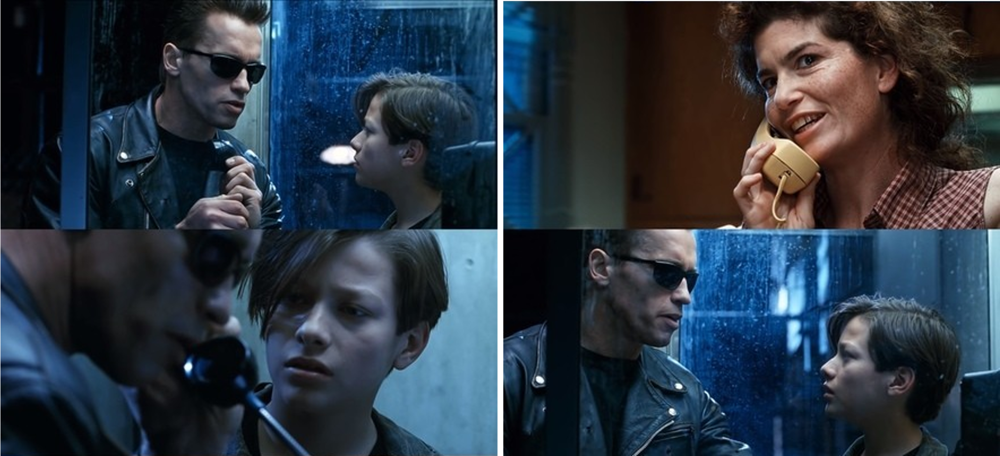

# Fake-Voice-Detection - AI Model

## Introduction 
In today's digital age, voice authentication is increasingly prevalent across various platforms. As such, the security of voice verification systems is paramount. This project addresses the urgent need for robust anti-spoofing measures by developing an effective AI model distinguishing between real and synthetic voices.

## Background 
Do you recall the moment in the movie Terminator where two Terminators were attempting to fool one another by voice-cloning a human? These days, it only takes a few minutes to replicate someone else's voice which is the basis of many scams. This inspired us to build a Fake Voice Detection model using AI & ML techniques to prevent malicious activities. 



## Objectives
The primary objective of this project is to enhance the security of voice-based systems by providing a tool that can accurately detect fake voices. This AI model leverages advanced machine-learning techniques to analyse audio samples and identify characteristics that differentiate genuine human voices from computer-generated or altered ones.

## Our Approach
- Convolutional Neural Networks - We will use a CNN model on the generated spectrograms of each audio and train the model on these images.
- Recurrent Neural Networks - Since RNNs can easily handle sequential data like audio, we will use the Long Short Term Memory model (LSTM) and directly use the audio files to train the model.
- Comparison -  We will compare both these model on their metrics as well as complexity and time taken to train the models.
- Weights & Biases - We will be using this tool to track the model’s training.

## Dataset

We will use Logical Access Dataset in ASVspoof 2019 competition, an English-speaking database of 96 kHZ sampling rate. With a total of 8 male and 12 female speakers. 

## Models 

### Convolutional Neural Network (CNN)

#### Overview
- A CNN is a class of deep neural networks, most commonly applied to analyzing visual imagery. 
- CNNs are known for their hierarchical structure which consists of multiple layers that process and transform an input to produce a specific output.
- They are usually known for their model development using Image Processing
But in the case of Audio, the audio signals can be converted into images which are known as spectrograms.


#### Methodology

- For performing the CNN model on our audio dataset, we converted our audio samples into images in the form of spectrograms 
- From the spectrogram, we split our dataset into training and testing and performed the model fitting
- Finally, we plot graphs and calculate the performance metrics

#### Results
- Accuracy: 93.87%
- Recall: 58.45%
- Precision: 75.70%
- F1 Score: 65.97%

Confusion Matrix for CNN


### Long Short Term Memory (LSTM)

#### Overview
- LSTM is a recurrent Neural Network (RNN), mostly used in the field of Deep Learning
- They have feedback connections which make them capable of processing entire sequences of data. 
- The capability of LSTM to remember and forget information selectively makes it very effective for speech recognition where the context or sequence of past information is key to understanding the current input.

#### Feature Extraction 
- Mel Frequency Cepstral Coefficients (MFCCs) are one of the most popular feature representations used for sound analysis, particularly in speech and audio recognition tasks. MFCCs provide a way to capture the timbral and textural aspects of sound in a form that is well-suited for machine learning models, especially those dealing with audio signals like voice.
- For this project, we use a function to extract features from the audio file that loads an audio file, computes the MFCCs, and transposes the result so that each time-step is a row, and each feature (MFCC) is a column, suitable for LSTM processing.


#### Methodology 
- For performing LSTM on our audio datasets, we extract the features of the audio using MFCC as explained.
- Next, we split the data into 75% training data and 25% test data sets.
- We use this data to create and fit our model with 10 epoch for best results.
- Post this we calculate the metrics to evaluate the model.

#### Results 
- Accuracy: 97.68%
- Recall: 87.13%
- Precision: 89.25%
- F1 Score: 88.18%

Confusion Matrix for LSTM


## Installation

To install the following project, clone the repository using: 
```bash
git clone https://github.com/tanushreearora01/Fake-Voice-Detection---AI-Model.git
```

Now, move into the newly created folder using: 
```bash
cd Fake-Voice-Detection---AI-Model
```

To make this project run, you will first need to install all the pip packages mentioned in the requirements.txt file. 
You can do this using:
```bash
pip install -r requirements.txt
```

## Conclusion 
As we can conclude from the results, Long Short Term Memory is more efficient than Convolutional Neural Network. 
LSTM's feedback connection approach makes it better to perform sequential data, making it easier to process audio files. 
## Contributors 

- Tanushree Arora 
- Tarasha Bansal

## References 
[ASVspoof2019](https://www.asvspoof.org/index2019.html)